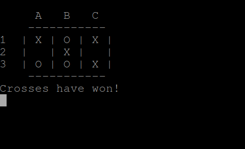
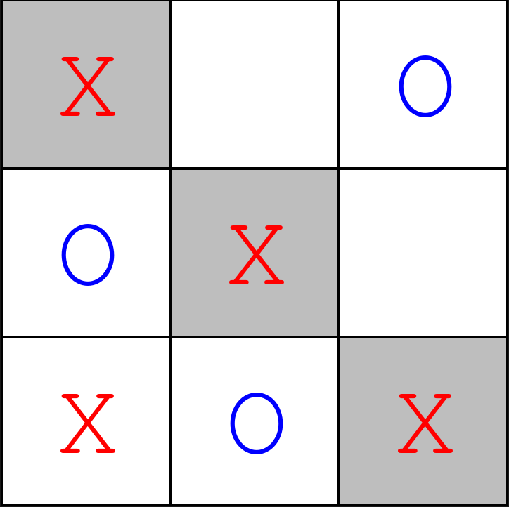

# Noughts and Crosses solver
This was a project i made with both a command line interface (game_cli.py) and a graphical interface (game_tui.py). 
It uses minimax with a random first move to keep it interesting.
Because it plays optimally, it is impossible to lose to it.

The files `noughts_and_crosses.py` and `util.py` are common modules to both the command line interface `game_cli.py` and graphical interface `game_pygame.py`.

> `python game_cli.py`

>`python game_cli.py`

